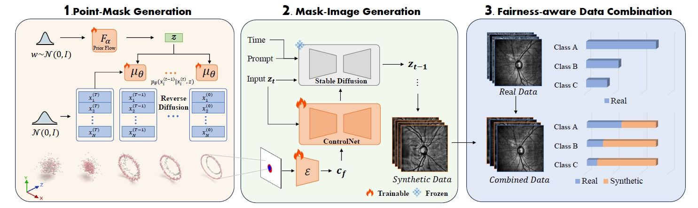

# FairDiff: Fair Segmentation with Point-Image Diffusion



[MICCAI 2024] The official code repository for paper "FairDiff: Fair Segmentation with Point-Image Diffusion".

## Installation

You can install the necessary dependencies using the provided conda environment YAML file:

```
# Create the environment
conda env create -f env.yml
# Activate the environment
conda activate FairDiff
```


## Data Preparation

Please follow the instruction in  this [**link**](https://github.com/Harvard-Ophthalmology-AI-Lab/FairSeg) to download Harvard-FairSeg Dataset in `.npz` format.

Convert the original fundus data ( `.npz` format) to images and labels ( `.png` format). Ensure to modify the data path accordingly:

```
python data_convert.py 
```


## Point-Mask Generation

### Data preparation
Note that there are several categories: 'ethnicity', 'gender', 'language', 'maritalstatus', and 'race'. Each category contains different attributes. For example, under the gender category, there are two attributes: Female and Male.

```bash
cd PointMaskGen/data/pointcloud
python labeloutline2pc.py --category_path /datasets/MedicalImage/txt/gender
# --category_path saves the image paths of all the attributes under a category.
python generate-txt.py --categories gender
```
### Training
```bash
cd Point-Image/Pointdiffusion
python train.py --categories gender --attributes Female
```
### Mask Generation
```bash
python inference.py --categories gender --attributes Female --resume_path xxx.ckpt
```


## Mask-Image Generation

We utilize [ControlNet](https://github.com/lllyasviel/ControlNet) to generate images from masks.

### Training

Train a mask-image generation model for each group with different sensitive attributes to generate corresponding images:

```bash
cd MaskImageGen
python train.py --attr_type <attr> --name <specific attribute to train>
```

### Images Generation

Generate corresponding images using:

```bash
CUDA_VISIBLE_DEVICES=0 python infer.py  \
    --attr_type ${ATTR_TYPE} --name ${NAME} \
    --ckpt ${CHECKPOINT} \
    --images 10000 \
    --save_path ${SAVE_PATH}
```

or

```bash
bash infer.sh
```

### Data packing

After generating images, pack images and labels into `.npz` files for the next segmentation task:

```bash
python packing.py
```

`.npz` files contain the following keys:

- `slo_fundus`: Scanning laser ophthalmoscopy (SLO) fundus image

- `disc_cup_mask`: Disc and cup masks for the corresponding SLO fundus image

- `age`: Patient's age

- `gender`: 0 - Female, 1 - Male

- `race`: 0 - Asian, 1 - Black, 2 - White

- `ethnicity`: 0 - Non-Hispanic, 1 - Hispanic, -1 - Unknown

- `language`: 0 - English, 1 - Spanish, 2 - Others, -1 - Unknown

- `maritalstatus`: 0 - Married or Partnered, 1 - Single, 2 - Divorced, 3 - Widowed, 4 - Legally Separated, -1 - Unknown

  

### Evaluate

To assess the generation quality, employ FID, minimum matching distance (MMD), and coverage score (COV):

Calculate FID:

```bash
python -m pytorch_fid path/to/dataset1 path/to/dataset2
```

Calculate MMD and COV:

```bash
python evaluate.py --ref_folder original_image_path --gen_folder generate_image_path --csv_path save_path
```


##  Fair Segmentation

To verify the impact of our synthetic data on segmentation and fairness, we selected two segmentation models, including a classic model TransUNet and a larger model SAMed.

```bash
# Using TransUNet
cd Segmentation/TransUNet

# Using SAMed
cd Segmentation/SAMed
```


### Data Combination

In order to ensure that the data used in all experiments is strictly consistent, the mixing methods of different types of data and the usage of synthetic data under different conditions have been written into `txt` files and stored in the `lists/` directory. 

You can use the command below for more data list generation.

```bash
python data_combination.py
```

In order to visually demonstrate our experimental process, the list files generated in our environment have not been deleted, but have been anonymized.

### Training

First, prepare the dataset according to the synthesis and balancing methods mentioned in the paper, and use the generated list mentioned above for the experiment you want to complete.

In `train.sh`, please specify the base_dir, list_dir and attributes you want to use.  Finally, run this command.

```
./train.sh
```

### Testing

For testing, please specify the base_dir, attribute, path of pretrained lora checkpoint, and output_dir. Then run this command.

```
./test.sh
```

## Model Zoo
Coming Soon...
